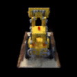
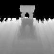

# NeRF

Minimal Jax implementation of [NeRF: Representing Scenes as Neural Radiance Fields for View Synthesis](https://arxiv.org/abs/2003.08934).

## Result of Tiny-NeRF

<table>
<thead>
  <tr>
    <th>RGB</th>
    <th>Depth</th>
  </tr>
</thead>
<tbody>
    <td></td>
    <td></td>
</tbody>

## Acknowledgements

- Official Keras implementation of NeRF - [https://github.com/bmild/nerf](https://github.com/bmild/nerf)
- NeRF tutorial on Keras docs - [https://keras.io/examples/vision/nerf](https://keras.io/examples/vision/nerf)
- Jax implementations of NeRF: [Official](https://github.com/google-research/google-research/tree/master/jaxnerf) and [unofficial](https://github.com/myagues/flax_nerf). 
- [PyTorch Lightning implementation of NeRF](https://github.com/kwea123/nerf_pl) and the corresponding [YouTube playlist](https://youtube.com/playlist?list=PLDV2CyUo4q-K02pNEyDr7DYpTQuka3mbV).
